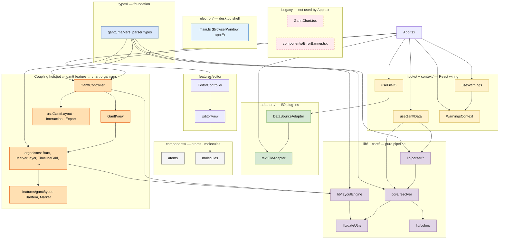

# Project Nexus: Design Diagrams

## 0. High-level modules, responsibilities, and dependencies (color-coded)

**Legend**

| Color | Meaning |
| --- | --- |
| Blue | **Foundation** — shared types; no inward project imports. |
| Teal | **I/O boundary** — pluggable adapters behind `DataSourceAdapter`. |
| Green | **Pure domain pipeline** — parse, resolve, layout math; no React. |
| Purple | **React glue** — hooks and context wiring application state. |
| Gray | **UI kit** — atoms/molecules; mostly generic presentation. |
| Orange | **Coupling hotspot** — feature and chart UI share types and `layoutEngine` in both directions; good candidate for a dedicated `gantt-chart/` or `packages/chart-ui` module with a single public surface. |
| Red (dashed) | **Legacy / parallel paths** — not on the main `App` tree; consolidate or remove to avoid drift. |

**Responsibilities (short)**

- **`types/`** — `GanttData`, parse results, markers, warnings.
- **`adapters/`** — open/save/saveAs for a data source (browser FSA, legacy file input, future CSV).
- **`lib/parser/`** + **`core/resolver`** — text → structured model → resolved dates, bounds, warnings.
- **`lib/layoutEngine`** + **`lib/dateUtils`** + **`lib/colors`** — geometry, weeks, palette.
- **`hooks/`** — `useFileIO`, `useGanttData`, `useWarnings` compose the above for React.
- **`context/`** — warning aggregation for `ErrorBanner` without prop drilling.
- **`features/editor`** — editor panel + file chrome.
- **`features/gantt`** — chart controller, layout/interaction/export hooks, `GanttView` assembly.
- **`components/`** — shared atoms/molecules/organisms; chart organisms depend on **both** `features/gantt` types and `lib/layoutEngine`.
- **`electron/`** — desktop shell (window, `app://` protocol); separate from the Vite/React tree.



**Modularisation notes (orange cluster)**

- **`GanttController`** maps `GanttData` → `BarItem[]` / `Marker[]` using **`layoutEngine`** and **`features/gantt/types`**; **`GanttView`** then delegates to **`components/organisms`** that import the same **`layoutEngine`** constants and **`BarItem` / `Marker`**. That is a **round trip** between `features/gantt` and `components/organisms`.
- A natural next step is to **co-locate** chart-specific organisms under `features/gantt/` (or extract a **`@nexus/gantt-ui`** package) so **`layoutEngine` + bar/marker view types** share one module boundary.
- **`electron/`** is already isolated; keep protocol and window logic out of `src/`.

**Legacy (red)**

- **`src/components/GanttChart.tsx`** and **`src/components/ErrorBanner.tsx`** duplicate responsibilities of the feature + organism paths; removing or re-exporting from a single place reduces confusion.

---

## 1. Layer Dependency

What can import what. Lower layers never import from higher.

```
┌─────────────────────────────────────────────────────────┐
│  App.tsx                                                │  Layer 8
└────────────────────┬────────────────────────────────────┘
                     │ imports
┌────────────────────▼────────────────────────────────────┐
│  features/  (GanttController, EditorController,         │  Layer 7
│             GanttView, EditorView, feature hooks)       │
└──────┬───────────────────────┬──────────────────────────┘
       │                       │
┌──────▼───────┐    ┌──────────▼──────────────────────────┐
│  context/    │    │  components/  (atoms, molecules,    │  Layer 6
│  Warnings    │    │               organisms)             │
└──────┬───────┘    └──────────┬──────────────────────────┘
       │                       │
┌──────▼───────────────────────▼──────────────────────────┐
│  hooks/  (useFileIO, useGanttData, useWarnings)         │  Layer 4-5
└──────┬──────────────────────────────────────────────────┘
       │
┌──────▼──────────────────────────────────────────────────┐
│  core/resolver.ts                                       │  Layer 3
└──────┬──────────────────────────────────────────────────┘
       │
┌──────▼──────────────────────────────────────────────────┐
│  lib/  (dateUtils, colors, layoutEngine, parser/*)      │  Layer 2
└──────┬──────────────────────────────────────────────────┘
       │
┌──────▼──────────────────────────────────────────────────┐
│  adapters/  (DataSourceAdapter, textFileAdapter)        │  Layer 1
└──────┬──────────────────────────────────────────────────┘
       │
┌──────▼──────────────────────────────────────────────────┐
│  types/  (gantt.ts, markers.ts, parser.ts)              │  Layer 0
│  No imports from inside project                         │
└─────────────────────────────────────────────────────────┘
```

---

## 2. Component Hierarchy (Atomic Design)

```
App.tsx
├── WarningsContext.Provider
├── EditorController              [feature controller]
│   └── EditorView                [feature view]
│       ├── FileBar               [molecule]
│       │   ├── DirtyIndicator    [atom]
│       │   ├── IconButton (Open) [atom]
│       │   ├── IconButton (Save) [atom]
│       │   └── IconButton (SaveAs) [atom]
│       └── <textarea>            [native element]
│
└── GanttController               [feature controller]
    ├── ChartToolbar              [organism]
    │   ├── ChartLegend           [molecule]
    │   └── IconButton (Export)   [atom]
    │
    └── GanttView                 [feature view]
        ├── LabelColumn           [organism — SVG, fixed left]
        ├── <scrollable div>
        │   ├── TimelineGrid      [organism — SVG layer]
        │   ├── QuarterHeader     [organism — SVG layer]
        │   ├── Bars              [organism — SVG layer, generic bars]
        │   └── MarkerLayer       [organism — SVG layer]
        │       ├── (today)       [rendered by switch on marker.type]
        │       └── (milestones)  [rendered by switch on marker.type]
        └── Tooltip               [molecule — floating overlay]

ErrorBanner                       [organism, reads WarningsContext]
└── IconButton (Dismiss)          [atom]
```

---

## 3. Data Flow

```
  ┌──────────────────────────────────────────────────────────────┐
  │  USER TYPES TEXT IN EDITOR                                   │
  └──────────────────────────┬───────────────────────────────────┘
                             │ onChange(text)
                             ▼
                    ┌─────────────────┐
                    │  useFileIO      │ state: text, fileName,
                    │  (EditorCtrl)   │        isDirty, fileErrors
                    └────────┬────────┘
                             │ text
                             ▼
                    ┌─────────────────┐
                    │ useGanttData    │ [useMemo — reruns on text change]
                    │  (App.tsx)      │
                    └────────┬────────┘
                             │
              ┌──────────────▼──────────────┐
              │  lib/parser/                │
              │  parseGanttText(text)       │──► ParseResult + ParseWarning[]
              │  (pure function)            │
              └──────────────┬──────────────┘
                             │ ParseResult
              ┌──────────────▼──────────────┐
              │  core/resolver.ts           │
              │  resolveGanttData(parsed)   │──► GanttData + ParseWarning[]
              │  (pure function)            │
              └──────────────┬──────────────┘
                             │
              ┌──────────────▼──────────────┐
              │  useWarnings (App.tsx)      │
              │  + WarningsContext          │──► ErrorBanner
              └──────────────┬──────────────┘
                             │ GanttData
              ┌──────────────▼──────────────┐
              │  GanttController            │
              └──────────────┬──────────────┘
                             │
         ┌───────────────────┼──────────────────────┐
         ▼                   ▼                       ▼
  useGanttLayout      useGanttInteraction      useGanttExport
  (rows, heights,     (hoveredId, tooltip,     (exporting,
   todayX, etc.)      event handlers)           handleExport)
         │
         ▼
  lib/layoutEngine.*  ◄── pure geometry functions
         │
         ▼
  GanttView
  ├── Bars (BarItem[] derived from tasks)
  ├── MarkerLayer (Marker[] = today + milestones)
  ├── LabelColumn, TimelineGrid, QuarterHeader
  └── Tooltip
```

---

## 4. Adapter Interface (Data Source Swap)

```
           DataSourceAdapter (interface)
           ┌────────────────────────────┐
           │ open()  → {content, name}  │
           │ save()  → {name}           │
           │ saveAs() → {name}          │
           └─────────┬──────────────────┘
                     │ implements
        ┌────────────┴──────────────┐
        │                           │
 textFileAdapter           csvAdapter (future)
 (FSA API + fallback)      (reads CSV → content)
        │
        └── injected into useFileIO(adapter)

  To add CSV support:
  1. Write csvAdapter.ts implementing DataSourceAdapter
  2. Change one line in EditorController.tsx
  ─────────────────────────────────────────
  Zero other files change.
```

---

## 5. MarkerLayer Type Dispatch

```
MarkerLayer receives: Marker[]

  Marker = today | milestone | (future: checkpoint, sprintBoundary, ...)

  ┌─────────────────────────────────────────────┐
  │  markers.map(marker => {                    │
  │    switch (marker.type) {                   │
  │                                             │
  │      case 'today':                          │
  │        → red dashed vertical line           │
  │          + "Today" label                    │
  │                                             │
  │      case 'milestone':                      │
  │        → diamond ◆ at top                  │
  │          + dashed vertical line             │
  │          + date label at bottom             │
  │          + hover interaction                │
  │                                             │
  │      case 'checkpoint': (future)            │
  │        → flag icon                          │
  │          + section-scoped line              │
  │    }                                        │
  │  })                                         │
  └─────────────────────────────────────────────┘

  Adding a new marker type:
  1. Add union member to Marker type in features/gantt/types.ts
  2. Add case in MarkerLayer's switch
  ──────────────────────────────────────────────
  Zero other files change.
```
